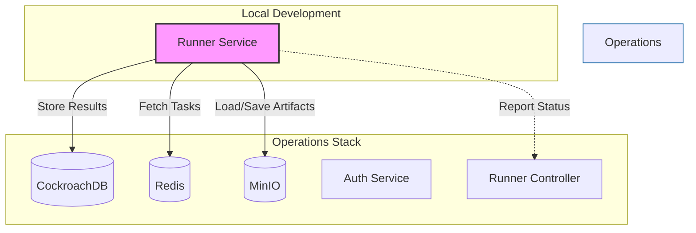

# Runner Service

The **Runner** service is a core component responsible for executing evolutionary algorithms. This guide explains how to set up and run the runner service locally using Docker, integrated with the rest of the operational stack.

## Prerequisites

Before running the runner, you must have the full operations stack up and running. This includes databases, authentication, and other microservices.

1.  **Clone the Operations Repository**:
    ```bash
    git clone https://github.com/Evolutionary-Algorithms-On-Click/operations.git
    ```

2.  **Follow the Docker Setup Instructions**:
    Navigate to the `operations/docker` directory and follow the [README instructions](https://github.com/Evolutionary-Algorithms-On-Click/operations/tree/main/docker) to start all services.
    
    Ensure you run:
    ```bash
    docker compose up -d
    ```
    This will start all containers, including a pre-built version of the runner.

## Running the Local Runner

To develop or test changes in the runner repository, you need to replace the pre-built runner container with your local code.

### Step 1: Stop the Existing Runner

Since the `operations` docker-compose starts a `runner` container, you must stop it to avoid port conflicts and ensure your local version connects instead.

```bash
docker stop runner
```

### Step 2: Configure Environment

The `docker-compose.yml` in this repository is pre-configured to connect to the services running from the `operations` stack (using `host.docker.internal` for cross-container communication).

**Key Environment Variables:**
*   `COCKROACHDB_URL`, `REDIS_URL`: Connect to databases via host networking.
*   `MINIO_URL`: Connects to the object storage.
*   `WEBSOCKET_LOG_URL`: For real-time logging.

Ensure your local `.env` or the default values in `docker-compose.yml` match the credentials set in your `operations` setup (e.g., `MINIO_ACCESS_KEY`, `MINIO_SECRET_KEY`).

### Step 3: Start the Runner

Run the runner using the localized `docker-compose.yml`. This builds the image from your current source code.

```bash
# Build and start the runner
docker compose up --build
```

You should see logs indicating the runner is starting and connecting to Redis/CockroachDB.

## Architecture

The following diagram illustrates how the Runner interacts with other operational services:

